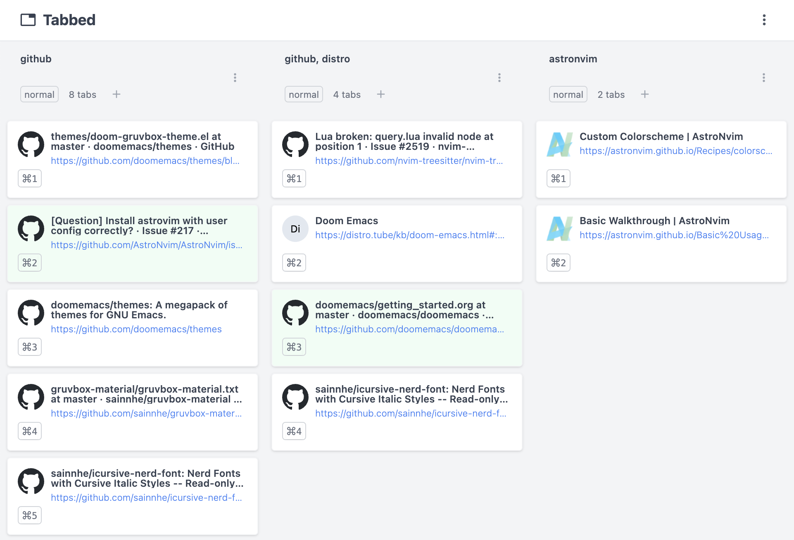

<p align="center">
  
</p>

<h1 align="center">Tabbed</h1>

Visualize and organize your browser sessions, windows and tabs.



## Features

- [x] Quick tab actions
  - [x] Reorder and reassign to separate window with drag and drop
  - [x] Focus, close and drag to new window
  - [x] Pin with animated reorder
  - [x] Free memory
  - [x] Mute
- [x] Quick window actions
  - [x] Custom reorder with drag and drop
  - [x] Change state
  - [x] View tab count, focused window and active tab
  - [x] Focus, close and open new tab
  - [x] Incognito window support
- [x] Settings
  - [x] Theme, font size, etc
- [x] Extension popup, popout window and tab view
- [x] Shortcuts to open extension, access settings, help and focus windows
- [x] Extension window customization - tab, popup and popout window
  - [x] All extension popups receive updates to windows and tabs
  - [x] Settings are applied to all open clients and background tasks
- [x] Move tabs with keyboard (see related bug)
- [ ] Better tab and focus ring support
- [ ] Search tabs
- [ ] Multi-tab drag and drop
- [ ] Support combining windows
- [ ] Allow custom titles on windows
- [ ] View saved sessions
- [ ] View recently closed tabs/windows
- [ ] Support tab groups
- [ ] Undo/redo support

## Privacy

See this extension's [Privacy Policy](./PRIVACYPOLICY.md).

## Develop

Install dependencies.

```
npm install
```

Start development server.

```
npm start
```

#### Chrome

Navigate to `chrome://extensions`, enable "Developer mode", select "Load unpacked" and open the `dist/` folder. See [Chrome's developer instructions](https://developer.chrome.com/docs/extensions/mv3/getstarted/).

#### Firefox

Navigate to `about:debugging`, select "This Firefox", "Load Temporary Addon-on..." and open the `dist/` folder. See [Firefox's Extension Workshop](https://extensionworkshop.com/documentation/develop/temporary-installation-in-firefox/).

### Notes

- [Differences between API implementations](https://developer.mozilla.org/en-US/docs/Mozilla/Add-ons/WebExtensions/Differences_between_API_implementations)
- [Browser support for JavaScript APIs](https://developer.mozilla.org/en-US/docs/Mozilla/Add-ons/WebExtensions/Browser_support_for_JavaScript_APIs)
- [rollup-plugin-chrome-extension supports Firefox >=v89](https://github.com/extend-chrome/rollup-plugin-chrome-extension#%EF%B8%8F-what-about-firefox-support)

### Related issues

- [Safari support](https://github.com/mozilla/webextension-polyfill/issues/234)
- [Dragging tabs autoscroll to windows out of view](https://github.com/hello-pangea/dnd/issues/537)
